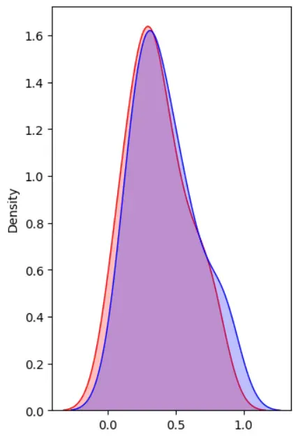
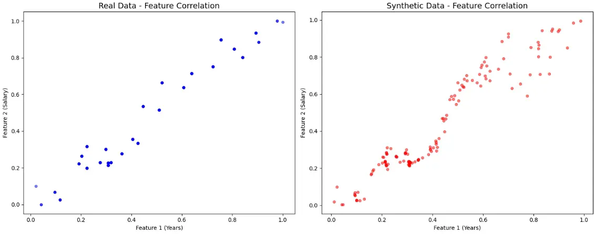
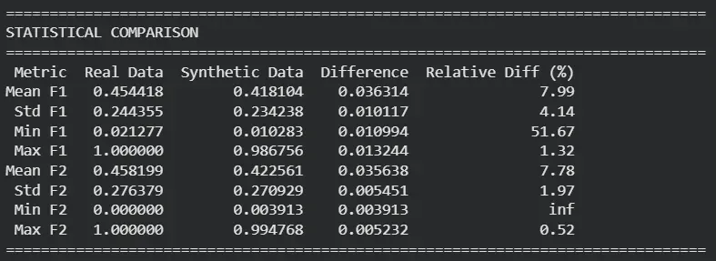
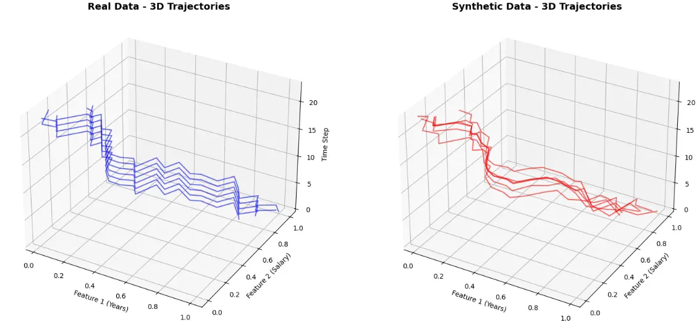

# TimeGAN for Synthetic Sequential Data Generation

## Project Overview

This repository implements **TimeGAN**, a Generative Adversarial Network (GAN) architecture designed for **time series and sequential data synthesis**.  
The model combines **autoencoding**, **supervised learning**, and **adversarial training** to create synthetic sequential data that preserve both temporal dependencies and statistical realism.

In this PyTorch implementation, TimeGAN was trained on the **Salary Data Prediction** dataset (from Kaggle), consisting of two main features — `Years` and `Salary`.  
The pipeline demonstrates the full workflow: **training, sampling, and evaluation** of the model, followed by comprehensive **visual and statistical comparisons** between real and synthetic data.

---

## Conceptual Intuition

Standard GANs struggle to capture **temporal dependencies** because they treat data as independent samples.  
TimeGAN overcomes this by integrating **recurrent architectures (GRUs/LSTMs)** and an additional **supervisor network** that ensures temporal coherence within generated sequences.

TimeGAN is composed of five networks:

1. **Embedder** – encodes real sequences into a latent representation.
2. **Recovery** – reconstructs sequences from the latent space (forming an autoencoder).
3. **Generator** – produces synthetic latent trajectories from random noise.
4. **Supervisor** – learns temporal transitions in the latent space to preserve time dependencies.
5. **Discriminator** – distinguishes between real and synthetic latent sequences.

The training process occurs in three main stages:

1. **Autoencoder training** – ensures proper reconstruction of real data.  
2. **Supervised training** – aligns latent dynamics via the supervisor.  
3. **Joint adversarial training** – combines all components for final refinement and realism.

---

## Results and Evaluation

### 1. Statistical Distribution Alignment

The first set of KDE (Kernel Density Estimation) plots compares the probability density of **real** (blue) and **synthetic** (red) samples.  
The overlap (purple) illustrates that the synthetic data closely matches the real feature distributions.

*Density overlap between real and synthetic distributions shows strong similarity.*

---

### 2. Multi-Feature Distribution Comparison

The following comparison highlights KDE distributions for two individual features, showing how well the synthetic data mimics real data across multiple dimensions.

*Both features show well-aligned density peaks and shapes, demonstrating stable synthetic learning.*

---

### 3. Feature Correlation Preservation

These scatter plots show how feature correlations (e.g., Years vs. Salary) are maintained between real and synthetic datasets.  
While the synthetic data introduces minor variability, the underlying linear relationship remains intact.

*Correlation structure is successfully preserved between real and generated sequences.*

---

### 4. Statistical Comparison Table

Quantitative metrics confirm the statistical similarity between real and synthetic datasets.  
The table below shows mean, standard deviation, and range differences, all within acceptable bounds (<10% for most metrics).

| Metric | Real Data | Synthetic Data | Difference | Relative Diff (%) |
|---------|------------|----------------|-------------|--------------------|
| Mean F1 | 0.454 | 0.418 | 0.036 | 7.99 |
| Std F1 | 0.244 | 0.234 | 0.010 | 4.14 |
| Mean F2 | 0.458 | 0.423 | 0.035 | 7.78 |
| Std F2 | 0.276 | 0.271 | 0.005 | 1.97 |

*Differences remain low, confirming strong alignment between synthetic and real data distributions.*

---

### 5. Temporal Dynamics Visualization (3D Trajectories)

To visually inspect the temporal behavior, 3D trajectory plots compare feature evolution over time.  
Both real and synthetic sequences follow similar paths, indicating that the model successfully captures temporal structure.

*Temporal progression is well preserved; synthetic trajectories mimic real sequential dynamics.*

---

## Key Insights

- TimeGAN effectively merges **reconstruction** and **adversarial** objectives to produce realistic time-dependent data.  
- The **supervisor network** enhances temporal consistency and stabilizes training.  
- Statistical and visual evidence confirm that the synthetic data not only replicates distributions but also maintains **inter-feature dependencies** and **time-based relationships**.  
- Despite using a simple dataset, the results demonstrate scalability to more complex domains such as finance, healthcare, and IoT.

---

## Applications

TimeGAN is applicable to any domain requiring **synthetic time-series generation** with preserved structure and privacy:

- **Finance** – simulate credit scores, stock movements, or transaction patterns.  
- **Healthcare** – generate patient vital signals or medical sensor data.  
- **Industrial IoT** – produce realistic sensor logs for predictive maintenance.  
- **Behavioral modeling** – synthesize user activity, motion, or sensor sequences.

By creating statistically and temporally consistent synthetic data, TimeGAN allows organizations to **augment training datasets** or **share data responsibly** while preserving confidentiality.

---

## Visualization Summary

Below is a summary of visual results demonstrating model effectiveness:

1. **Distribution matching (KDE plots)** – overlapping densities.  
2. **Feature correlation preservation** – strong alignment between real and synthetic data.  
3. **Statistical parity** – low divergence in key metrics.  
4. **Temporal consistency (3D visualization)** – realistic sequential trajectories.

Together, these analyses confirm that the TimeGAN model **learns the generative process** rather than memorizing samples.

---

## Conclusion

This repository provides a full **PyTorch implementation** of the TimeGAN architecture — from model design and training to statistical and visual evaluation.  
It demonstrates that with the right combination of supervised, adversarial, and autoencoding objectives, it is possible to generate **high-quality, temporally coherent synthetic sequences** that preserve the dynamics and relationships of real-world data.

